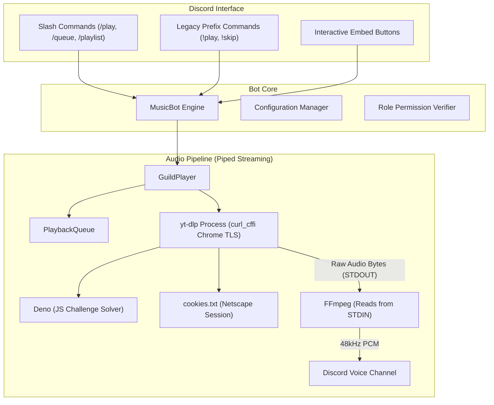

# Discord Music Bot 🎵

[](https://www.python.org/downloads/)
[](https://github.com/Rapptz/discord.py)
[](https://github.com/yt-dlp/yt-dlp)
[](https://opensource.org/licenses/MIT)

A modern, high-performance, self-hosted Discord music bot built with **Python**, **`discord.py` 2.x**, **FFmpeg**, and **`yt-dlp`**.

Engineered specifically for bulletproof reliability on cloud servers (AWS, DigitalOcean, Hetzner, Linode) where YouTube blocks datacenter IPs. Features piped audio streaming to permanently eliminate `HTTP 403 Forbidden` errors, automated JavaScript challenge solving via Deno, browser TLS impersonation, local high-res playlists (MP3, FLAC, OGG, WAV), role-based permissions, an interactive setup wizard, and 24/7 systemd service automation.

> [!NOTE]
>
> **1. This project is tested/being tested ONLY on Ubuntu_24.04.1-x86_64**. Any tests on other Operating Systems, and feedback/bug reports are highly appreciated!
> 
> **2. Project Status:** Active Testing Phase (v1.0.0)
> This bot is currently in its active development and testing phase. Because YouTube continuously rolls out new anti-bot defenses, signature rotations, and client challenge ciphers, features and workarounds are actively evolving. Some bugs are **very likely** expected in this project, so feedback and contributions are welcome!

---

## Table of Contents

1. [Key Features](#key-features)
2. [Audio Engine Architecture](#audio-engine-architecture)
3. [System Prerequisites](#system-prerequisites)
   - [Linux (Ubuntu, Debian, CentOS, RHEL, Fedora, Arch)](#1-linux)
   - [macOS (Homebrew)](#2-macos)
   - [Windows (Windows 11, 10, Windows Server)](#3-windows-windows-11-windows-10-windows-server)
   - [Pre-Flight Verification](#4-pre-flight-verification)
4. [Step-by-Step Discord Setup (Creating Your Bot)](#step-by-step-discord-setup)
   - [1. Create the Application & Bot](#1-create-the-application--bot)
   - [2. Enable Required Gateway Intents](#2-enable-required-gateway-intents)
   - [3. Invite the Bot to Your Server](#3-invite-the-bot-to-your-discord-server)
5. [Installation & Setup](#installation--setup)
   - [1. Clone Repository](#1-clone-repository)
   - [2. Virtual Environment](#2-set-up-virtual-environment)
   - [3. Install Dependencies](#3-install-python-dependencies)
   - [4. Configure the Bot (Wizard or Manual)](#4-configure-the-bot)
6. [CLI Command-Line Interface (`main.py`)](#cli-command-line-interface-mainpy)
   - [`--setup` (Interactive Setup Wizard)](#1-interactive-setup-wizard---setup)
   - [`--check-config` (Diagnostic Health Check)](#2-diagnostic-health-check---check-config)
   - [`--config <path>` (Custom Config File)](#3-custom-config-file-path---config)
   - [Standard Launch](#4-standard-launch)
7. [YouTube Audio & Anti-Bot Architecture](#youtube-audio--anti-bot-architecture)
   - [Why Cloud Datacenter IPs Get Blocked](#why-cloud-datacenter-ips-get-blocked)
   - [Piped Streaming (Zero 403 Forbidden Errors)](#piped-streaming-zero-403-forbidden-errors)
   - [Multi-Client Strategy & Mobile Client Fallback](#multi-client-strategy--mobile-client-fallback)
   - [Built-In RAM Jitter Buffer (Smooth Audio Pacing)](#built-in-ram-jitter-buffer-smooth-audio-pacing)
   - [Exporting `cookies.txt` (Preventing Expiration)](#exporting-cookiestxt-how-to-prevent-cookies-from-expiring)
8. [Configurable Logging System](#configurable-logging-system)
   - [Log Levels & Presets](#log-levels--presets)
   - [Log Output Destinations](#log-output-destinations)
   - [Command Execution & Discord Internals](#command-execution--discord-internals)
   - [Log Rotation & Text Cleanliness](#log-rotation--text-cleanliness)
9. [Complete Configuration Reference](#complete-configuration-reference)
10. [Bot Presence / Status](#bot-presence--status)
11. [Local Playlists Setup](#local-playlists-setup)
12. [24/7 Production Deployment (systemd)](#247-production-deployment-systemd)
13. [Bot In-Discord Command Reference (Line-by-Line)](#bot-in-discord-command-reference-line-by-line)
    - [Playback Commands](#1-playback-commands)
    - [Queue Management Commands](#2-queue-management-commands)
    - [Local Playlist Commands](#3-local-playlist-commands)
    - [YouTube Data API Commands](#4-youtube-data-api-commands)
    - [General & Diagnostic Commands](#5-general--diagnostic-commands)
14. [Roles & Permission Hierarchy](#roles--permission-hierarchy)
    - [Understanding the 3 Permission Tiers](#understanding-the-3-permission-tiers)
    - [Step-by-Step Server Setup Guide](#step-by-step-discord-setup-guide-for-server-owners)
    - [Command Permission Comparison Matrix](#command-permission-comparison-matrix)
15. [Troubleshooting & FAQ](#troubleshooting--faq)

---

## Key Features

- **Piped Audio Streaming (`YTDLPPipeAudio`)**: Eliminates `HTTP error 403 Forbidden` by streaming audio data directly from `yt-dlp` into FFmpeg's `stdin`. FFmpeg makes **zero direct HTTP requests** to YouTube's CDN.
- **Multi-Client Strategy & Mobile Fallback**: Bypasses YouTube's aggressive "Sign in to confirm you're not a bot" challenge on datacenter IPs (AWS, DigitalOcean, Hetzner, GCP) by routing playback through Android, iOS, mobile web, and desktop clients, with automated cookie-less fallback.
- **Built-In RAM Jitter Buffer (`BufferedAudioSource`)**: Maintains a 2-second pre-buffer and 10-second memory queue, pacing 20ms audio packets to eliminate audio jitter, stuttering, and WebRTC fast-forward catchup distortion on cloud connections.
- **Dual Command Interface**: Full support for both modern **Discord Slash Commands** (`/play`, `/skip`) and traditional **prefix text commands** (`!play`, `!skip`). The prefix is configurable via `COMMAND_PREFIX` in `config.txt`.
- **Live Bot Presence / Status**: Displays a custom idle status when not playing (configurable via `IDLE_STATUS`), switches to "Listening to: *song title*" when playing, and reverts when playback stops. Updates in real-time on track changes with debounce protection against Discord rate limits.
- **Configurable Multi-Option Logging**: Full user control via `config.txt` over log levels (with intuitive presets like `EVERYTHING`, `VERBOSE`, `STANDARD`, `QUIET`, `ERRORS`), file output (`logs/bot.log`), console output, command tracking, and automatic log rotation with ANSI color stripping.
- **Deno JS Challenge Solver**: Executes YouTube's EJS signatures and n-parameter challenge solver scripts natively to bypass format restrictions (`The page needs to be reloaded`).
- **Browser TLS Impersonation**: Uses `curl_cffi` to mimic Google Chrome's JA3/JA4 TLS handshake fingerprint and HTTP/2 frames.
- **Interactive Setup Wizard**: Run `python3 main.py --setup` to configure tokens, channels, playlists, and settings interactively via CLI.
- **Pre-Flight Diagnostic Tool**: Run `python3 main.py --check-config` to validate FFmpeg, playlists, cookies, and configuration before connecting to Discord.
- **Local Audio Playlists Engine**: Scans nested directories for MP3, FLAC, OGG, and WAV files, parsing ID3 metadata, track numbers, and shuffle support automatically.
- **Interactive UI**: Discord embeds with interactive component buttons (Play/Pause, Skip, Stop) and paginated queue navigation.
- **Volume & Audio Control**: Real-time volume scaling (0% to 200%), timestamp seeking (`/seek`), and loop modes (`off`, `track`, `queue`).
- **Role-Based Access Control**: 3-tier permission hierarchy (Standard User, DJ Role, Server Administrator).
- **Auto-Leave Protection**: Disconnects from voice channels when idle or when all members leave, saving server bandwidth and memory.
- **Race-Condition-Free Track Switching**: Uses a generation counter to ensure that skip, previous, and seek commands never cascade through the queue, even under high-latency conditions.

---

## Audio Engine Architecture



---

## System Prerequisites

Before configuring or running the bot, your host machine must have **Python 3.10+**, **Git**, **FFmpeg**, and **Deno** installed.

| Component | Required Version | Purpose |
|---|---|---|
| **Python** | `3.10` / `3.11` / `3.12` | Core runtime (with `pip` and `venv` support) |
| **Git** | `2.x+` | Source control to clone and update the bot |
| **FFmpeg** | `4.x` / `5.x` / `6.x` / `7.x` | Audio decoding and real-time 48kHz stereo PCM transcoding |
| **Deno** | `1.30+` / `2.x` | JavaScript engine required by `yt-dlp` to solve YouTube's n-sig ciphers |
| **curl & unzip** | Any | System utilities for downloading and extracting dependencies |

---

### 1. Linux

#### A. Ubuntu / Debian / Linux Mint / Pop!_OS
```bash
# Update package repositories
sudo apt update

# Install Python, venv, pip, git, ffmpeg, and utilities
sudo apt install -y python3 python3-pip python3-venv git ffmpeg curl unzip

# Install Deno (crucial for YouTube challenge solving)
curl -fsSL https://deno.land/install.sh | sh
sudo cp ~/.deno/bin/deno /usr/local/bin/
```

#### B. RHEL / CentOS Stream / AlmaLinux / Rocky Linux
```bash
# Enable EPEL (Extra Packages for Enterprise Linux) and RPM Fusion (for FFmpeg)
sudo dnf install -y epel-release
sudo dnf install -y --nogpgcheck https://mirrors.rpmfusion.org/free/el/rpmfusion-free-release-$(rpm -E %rhel).noarch.rpm

# Install Python, pip, git, ffmpeg, and utilities
sudo dnf install -y python3 python3-pip git ffmpeg curl unzip

# Install Deno
curl -fsSL https://deno.land/install.sh | sh
sudo cp ~/.deno/bin/deno /usr/local/bin/
```

#### C. Fedora
```bash
# Enable RPM Fusion for FFmpeg
sudo dnf install -y https://mirrors.rpmfusion.org/free/fedora/rpmfusion-free-release-$(rpm -E %fedora).noarch.rpm
sudo dnf install -y python3 python3-pip git ffmpeg curl unzip

# Install Deno
curl -fsSL https://deno.land/install.sh | sh
sudo cp ~/.deno/bin/deno /usr/local/bin/
```

#### D. Arch Linux / Manjaro
```bash
sudo pacman -Syu --noconfirm python python-pip git ffmpeg deno curl unzip
```

---

### 2. macOS

Using [Homebrew](https://brew.sh/) (Recommended):

```bash
# Install Homebrew (if not already installed)
/bin/bash -c "$(curl -fsSL https://raw.githubusercontent.com/Homebrew/install/HEAD/install.sh)"

# Install all prerequisites in one command
brew update && brew install python@3.12 git ffmpeg deno unzip
```

---

### 3. Windows (Windows 11, Windows 10, Windows Server)

You can install all prerequisites using **Winget**, **Chocolatey**, or **Manual Installers**.

#### Option A: Windows Package Manager (`winget`) — Recommended for Windows 10/11
Open **PowerShell** (Run as Administrator) and run:
```powershell
winget install Python.Python.3.12 Git.Git Gyan.FFmpeg DenoLand.Deno
```
> [!IMPORTANT]
> After running `winget`, close and reopen your PowerShell or Terminal window so your environment `$PATH` updates.

#### Option B: Chocolatey — Recommended for Windows Server (2019, 2022, 2025)
Open an administrative PowerShell prompt:
```powershell
choco install python3 git ffmpeg deno -y
```

#### Option C: Manual Installation
1. **Python 3.12**: Download the Windows installer from [python.org](https://www.python.org/downloads/).  
   > ⚠️ **CRUCIAL**: On the first installer screen, **CHECK the box** that says **"Add python.exe to PATH"** before clicking Install.
2. **Git for Windows**: Download and run the installer from [git-scm.com](https://git-scm.com/download/win). Keep default options.
3. **FFmpeg**: Download the release build from [gyan.dev/ffmpeg/builds](https://www.gyan.dev/ffmpeg/builds/) (`ffmpeg-release-essentials.zip`), extract it to `C:\ffmpeg`, and add `C:\ffmpeg\bin` to your System Environment Variables `PATH`.
4. **Deno**: Open PowerShell and run:
   ```powershell
   irm https://deno.land/install.ps1 | iex
   ```

---

### 4. Pre-Flight Verification

Before cloning or configuring the bot, verify that all four essential tools are accessible in your terminal:

**Linux / macOS:**
```bash
python3 --version   # Should output Python 3.10.x, 3.11.x, or 3.12.x
git --version       # Should output git version 2.x+
ffmpeg -version     # Should show FFmpeg build banner
deno --version      # Should show Deno version banner
```

**Windows (PowerShell):**
```powershell
python --version    # Should output Python 3.10.x, 3.11.x, or 3.12.x
git --version       # Should output git version 2.x+
ffmpeg -version     # Should show FFmpeg build banner
deno --version      # Should show Deno version banner
```

---

## Step-by-Step Discord Setup

Before running the code, register your bot application with Discord:

### 1. Create the Application & Bot
1. Open the [Discord Developer Portal](https://discord.com/developers/applications).
2. Click **New Application** in the top right, name your bot (e.g. `MyMusicBot`), and accept the Developer Terms.
3. In the left navigation menu, click **Bot**:
   - Under the username, click **Reset Token** to generate a bot token.
   - **Copy and securely save this token.** (You will paste this into `config.txt` or enter it in the setup wizard).

### 2. Enable Required Gateway Intents
Scroll down on the **Bot** page to **Privileged Gateway Intents**:
- Enable **Message Content Intent** (Required for prefix command fallback).
- Enable **Server Members Intent** (Recommended for permission lookups).
- Ensure **Voice States Intent** is enabled (Required to track voice channel activity).
- Click **Save Changes**.

### 3. Invite the Bot to Your Discord Server
1. In the left navigation menu, click **OAuth2** -> **URL Generator**.
2. Under **Scopes**, check:
   - `bot`
   - `applications.commands` (Enables slash commands)
3. Under **Bot Permissions**, select:
   - **Text Permissions**: *Send Messages*, *Embed Links*, *Attach Files*, *Read Message History*, *Use External Emojis*
   - **Voice Permissions**: *Connect*, *Speak*, *Use Voice Activity*, *Priority Speaker*
4. Copy the **Generated URL** at the bottom, paste it into your browser, choose your Discord server, and click **Authorize**.

---

## Installation & Setup

### 1. Clone Repository
```bash
git clone https://github.com/noxianwill/DiscordMusicBot.git
cd DiscordMusicBot
```

### 2. Set Up Virtual Environment
Using a virtual environment isolates your project packages:

- **Linux / macOS**:
  ```bash
  python3 -m venv venv
  source venv/bin/activate
  ```
- **Windows (PowerShell)**:
  ```powershell
  python -m venv venv
  .\venv\Scripts\Activate.ps1
  ```
  *(If PowerShell shows a script execution error, run: `Set-ExecutionPolicy -ExecutionPolicy RemoteSigned -Scope CurrentUser`)*

### 3. Install Python Dependencies
```bash
pip install --upgrade pip
pip install -r requirements.txt
```

### 4. Configure the Bot

You have two options to configure your bot:

#### Option A: Interactive CLI Setup Wizard (Recommended)
Run the built-in wizard:
```bash
python3 main.py --setup
```
The wizard will prompt you step-by-step for your Bot Token, Command Channel ID, Playlists Directory, and YouTube API credentials, automatically writing a clean `config.txt` file.

#### Option B: Manual Configuration File
1. Copy the example configuration file:
   ```bash
   cp config.example.txt config.txt
   ```
2. Open `config.txt` in your favorite editor. See `config.example.txt` for the full annotated template with all available settings. Key settings:
   ```ini
   # Required: Discord Bot Token from Developer Portal
   DISCORD_BOT_TOKEN=your_bot_token_here

   # Optional: Restrict commands to a specific channel ID (leave empty for all channels)
   DISCORD_COMMAND_CHANNEL_ID=

   # Command prefix for text commands (slash commands always work)
   COMMAND_PREFIX=!

   # Path to folder containing local music playlists
   PLAYLISTS_DIRECTORY=./playlists
   SUPPORTED_FORMATS=.mp3,.flac,.ogg,.wav

   # YouTube Data API v3 integration mode (oauth, token, or disabled)
   YOUTUBE_AUTH_MODE=disabled
   YOUTUBE_CLIENT_ID=
   YOUTUBE_CLIENT_SECRET=

   # Bot presence / status
   IDLE_STATUS=Ready to play
   PLAYING_STATUS=Playing: {title}

   # Playback defaults
   DEFAULT_VOLUME=75
   LOOP_MODE=off
   MAX_QUEUE_SIZE=100

   # Voice channel behavior
   AUTO_LEAVE=true
   AUTO_LEAVE_DELAY=300

   # Permissions: Name of the Discord role that grants DJ playback controls
   # You can set this to ANY role name created on your server (e.g. DJ, Music Master, VIP)
   # Case-insensitive. Users without this role can only queue songs. Admins bypass automatically.
   DJ_ROLE_NAME=DJ

   # Logging
   LOG_LEVEL=INFO
   LOG_FILE=./logs/bot.log
   LOG_TO_FILE=true
   LOG_TO_CONSOLE=true
   LOG_COMMANDS=true
   LOG_DISCORD_INTERNALS=false
   LOG_YTDLP_VERBOSE=false
   LOG_AUDIO_BUFFER=false
   LOG_ROTATION_MB=10
   LOG_BACKUP_COUNT=5

   # History & state
   MAX_HISTORY_SIZE=50
   DATA_DIRECTORY=./data
   ```

---

## CLI Command-Line Interface (`main.py`)

The bot entrypoint `main.py` provides several powerful command-line flags:

### 1. Interactive Setup Wizard (`--setup`)
```bash
python3 main.py --setup
```
- **What it does**: Launches an interactive, terminal-based setup wizard (`bot/setup_wizard.py`).
- **Interactive Prompts**:
  1. `Enter Discord Bot Token`: Secure password input (hidden from screen) to paste your token.
  2. `Enter Command Channel ID`: Optional channel ID to restrict bot commands.
  3. `Enter Playlists Directory path`: Directory for local audio files (automatically verifies and creates the directory if missing).
  4. `Enable YouTube Auth?`: Configure YouTube Data API v3 mode (`disabled`, `oauth`, or `token`).
  5. If `oauth` is selected: prompts for `YouTube Client ID` and `YouTube Client Secret`.
- **Output**: Generates or updates `config.txt` and verifies directory structures.

### 2. Diagnostic Health Check (`--check-config`)
```bash
python3 main.py --check-config
```
- **What it does**: Performs a complete pre-flight diagnostic check of your environment without connecting to Discord.
- **Validations performed**:
  - Validates `config.txt` syntax, required keys, and data types.
  - Checks if `ffmpeg` binary is reachable in the system `$PATH`.
  - Checks if `PLAYLISTS_DIRECTORY` exists and reports the total count of valid playlist subfolders detected.
  - Validates `YOUTUBE_AUTH_MODE` and reports whether the bot will operate in `API` mode or `yt-dlp stream only` mode.
  - Confirms log level and data directory.
- **Exit Code**: Returns `0` if all checks pass, or `1` if any critical configuration is missing or broken.

### 3. Custom Config File Path (`--config`)
```bash
python3 main.py --config /path/to/custom_config.txt
```
- **What it does**: Directs the bot to load settings from an alternative configuration file instead of the default `./config.txt`. Useful for running staging/production instances on the same host.
- Can be combined with `--check-config` or `--setup`:
  ```bash
  python3 main.py --config prod.txt --check-config
  python3 main.py --config staging.txt --setup
  ```

### 4. Standard Launch
```bash
python3 main.py
```
- **What it does**:
  1. Automatically runs startup diagnostics and prints a summary banner.
  2. Initializes rotating file logging in `data/logs/` with sensitive token masking.
  3. Registers graceful shutdown handlers (`SIGINT`, `SIGTERM`).
  4. Initializes the Discord client, syncs global slash commands with Discord, and begins listening.

---

## YouTube Audio & Anti-Bot Architecture

### Why Cloud Datacenter IPs Get Blocked
When self-hosting a Discord bot on cloud VPS providers (AWS, DigitalOcean, Hetzner, Linode, GCP, OVH), YouTube detects connections originating from hosting datacenter IP subnets and applies strict automated defenses:
1. **HTTP 403 Forbidden (Access Denied)**: When traditional music bots pass stream URLs directly to FFmpeg, YouTube blocks FFmpeg's user-agent.
2. **"Sign in to confirm you're not a bot"**: When querying the standard desktop web player API without valid authentication, YouTube triggers bot verification challenges.
3. **Audio Jitter & Fast-Forwarding**: Network latency jitter and intermittent DASH fragment pauses can cause Discord's WebRTC audio player to fall behind real-time and suddenly fast-forward to catch up.

---

### Piped Streaming (Zero 403 Forbidden Errors)
Traditional Discord music bots extract a temporary `googlevideo.com` CDN URL and pass it to FFmpeg. Because FFmpeg connects using its internal `Lavf` user-agent without browser TLS signatures or session headers, YouTube immediately terminates the stream with `HTTP error 403 Forbidden`.

This bot eliminates 403 errors entirely through **Piped Streaming (`YTDLPPipeAudio`)**:
1. `yt-dlp` initiates the audio stream using browser TLS impersonation (`curl_cffi`), Deno JavaScript challenge solving, and session cookies.
2. `yt-dlp` streams raw decoded audio data directly to standard output (`stdout`).
3. FFmpeg reads audio data directly from standard input (`stdin` / `pipe:0`).
4. **FFmpeg never makes direct network requests to YouTube**, permanently bypassing CDN IP blocks.

---

### Multi-Client Strategy & Mobile Client Fallback
To defeat the `"Sign in to confirm you're not a bot"` challenge on cloud servers:
- **Mobile Client Endpoints**: The bot configures `yt-dlp` to query across multiple YouTube client targets (`android`, `ios`, `mweb`, `web`). YouTube's mobile clients utilize different authentication standards that are far less prone to datacenter IP blocks.
- **Automated Cookie Fallback**: If browser session cookies expire or are temporarily flagged by YouTube, the bot automatically retries extraction without cookies using mobile client endpoints, allowing playback to continue uninterrupted.

---

### Built-In RAM Jitter Buffer (Smooth Audio Pacing)
Cloud VPS connections can experience minor latency fluctuations and intermittent delivery pauses while fetching DASH audio fragments from YouTube. In standard bots, these pauses cause Discord's internal audio clock to drift, resulting in sudden bursts of fast-forward audio ("chipmunk effect") when the connection resumes.

This bot features a custom **Thread-Safe RAM Jitter Buffer (`BufferedAudioSource`)**:
- Pre-buffers **2 seconds** of decoded 48kHz stereo PCM audio into memory before audio delivery begins.
- Maintains up to **10 seconds** of decoded audio in RAM (~1.9 MB), absorbing network spikes and fragment download delays.
- Delivers audio frames at a rock-solid **50 frames per second (20ms intervals)**, ensuring consistent, jitter-free playback speed.
- Underflow safety: If network latency momentarily exhausts the buffer, the engine smoothly injects silence frames to preserve Discord's WebRTC audio clock alignment.

---

### Exporting `cookies.txt` (How to Prevent Cookies from Expiring)

Supplying your browser session cookies authenticates your bot as a regular user and allows it to access high-quality audio formats and age-restricted tracks.

> [!CAUTION]
> **CRITICAL: Always Use a Disposable / Burner Google Account!**  
> **NEVER** use your primary personal Google or YouTube account when exporting `cookies.txt`.  
> If YouTube's automated abuse detection flags high-frequency automated audio requests from a cloud datacenter IP (AWS, DigitalOcean, Hetzner, etc.), the account linked to those session cookies may face restrictions or termination. Always create a free secondary/burner Google account solely for your bot.

#### Why Normal Exports Expire Quickly
YouTube's desktop website runs continuous client-side single-page-app (SPA) JavaScript that rotates and invalidates session tokens (such as `SAPISID`, `__Secure-3PSID`, and `LOGIN_INFO`) as you navigate between pages or when tabs close. If you export cookies from an active browsing session, the tokens may already be invalidated by the time your bot uses them.

#### The `robots.txt` Clean-Export Method (Recommended by `yt-dlp`)
To obtain clean, stable session cookies that do not immediately invalidate:

1. **Open a New Incognito / Private Window**:
   - Open a fresh Private/Incognito browser window in Chrome, Firefox, or Brave.
2. **Sign into Your Burner Account**:
   - Navigate to [YouTube](https://www.youtube.com) and sign into your **secondary burner account**.
3. **Navigate to `robots.txt` in the Same Tab**:
   - In that **exact same browser tab**, navigate directly to:
     ```text
     https://www.youtube.com/robots.txt
     ```
   - **Why this works**: `robots.txt` is a static plain text file. Because YouTube's background JavaScript engines and telemetry trackers do not load on this page, YouTube cannot rotate or invalidate your session tokens.
4. **Export in Netscape Format**:
   - Open your cookie exporter extension (such as **Get cookies.txt LOCALLY**).
   - Click **Export** to save the file as `cookies.txt` in **Netscape** format.
5. **Close the Incognito Window Immediately**:
   - Close the entire private browsing session right away without browsing any other YouTube pages.
6. **Place `cookies.txt` in Your Bot Directory**:
   - Place the file in the bot's root folder:
     ```text
     DiscordMusicBot/cookies.txt
     ```
     *(Alternatively, inside `data/cookies.txt`)*.
   - Run `python3 main.py --check-config` to verify the bot detects `Cookies: OK (cookies.txt found)`.
   - *(Note: `cookies.txt` is already included in `.gitignore` so your credentials are never pushed to git repositories).*

---

## Configurable Logging System

The bot includes a production-grade, configurable logging subsystem that can be customized in `config.txt` without editing any code.

### Log Levels & Presets

Set `LOG_LEVEL` in `config.txt` using any standard Python level or intuitive preset:

| Level / Preset | Description | When to Use |
|---|---|---|
| `EVERYTHING` / `VERBOSE` / `DEBUG` | Logs all operations, YouTube resolution, queue changes, commands, and debug info. | Troubleshooting playback, YouTube queries, or server issues. |
| `STANDARD` / `INFO` *(Default)* | Clean operational logs (tracks played, commands run, errors, server joins). | Everyday normal operation (Recommended). |
| `QUIET` / `WARNING` | Only warnings and errors. | Low-noise environments. |
| `ERRORS` / `ERROR` | Only error events and fatal exceptions. | Maximum silence. |

### Log Output Destinations
- **File Logging (`LOG_TO_FILE=true`)**: Writes structured logs to the path specified by `LOG_FILE` (default: `./logs/bot.log`). Directories are created automatically.
- **Console Logging (`LOG_TO_CONSOLE=true`)**: Prints colored logs to terminal `stdout` for live monitoring.

### Command Execution & Discord Internals
- **Command Tracking (`LOG_COMMANDS=true`)**: Logs every slash command and prefix command executed, including username, user ID, server name, and channel name.
- **Discord Internals (`LOG_DISCORD_INTERNALS=false`)**: When running in `DEBUG`/`VERBOSE` mode, internal Discord gateway WebSocket heartbeats are suppressed to keep logs readable. Set to `true` if you need raw protocol debug frames.

### Log Rotation & Text Cleanliness
- **Automatic Rotation (`LOG_ROTATION_MB=10`)**: Automatically rotates log files when they reach the specified megabyte limit.
- **Backup Retention (`LOG_BACKUP_COUNT=5`)**: Retains historical rotated logs (`bot.log.1`, `bot.log.2`, etc.).
- **ANSI Color Stripping**: Automatically removes terminal ANSI escape color codes from log files so they remain clean and readable in standard text editors (Notepad, nano, vim, VS Code).
- **Server Name Formatting**: Server names and IDs are formatted cleanly in logs (e.g. `'My Server' (ID: 123456789012345678)`).

---

## Complete Configuration Reference

All settings are configured in `config.txt`. Environment variables (UPPERCASE) override file values. See `config.example.txt` for the full annotated template.

| Setting | Default | Description |
|---------|---------|-------------|
| **Discord** | | |
| `DISCORD_BOT_TOKEN` | *(required)* | Bot token from Discord Developer Portal |
| `DISCORD_COMMAND_CHANNEL_ID` | *(empty = all)* | Restrict commands to a specific channel ID |
| `COMMAND_PREFIX` | `!` | Prefix for text commands (`!play`, `!skip`, etc.) |
| **Playlists** | | |
| `PLAYLISTS_DIRECTORY` | `./playlists` | Path to local playlist folders |
| `SUPPORTED_FORMATS` | `.mp3,.flac,.ogg,.wav` | Audio file extensions to recognize |
| **YouTube** | | |
| `YOUTUBE_AUTH_MODE` | `disabled` | `oauth`, `token`, or `disabled` |
| `YOUTUBE_CLIENT_ID` | *(empty)* | Google Cloud OAuth Client ID |
| `YOUTUBE_CLIENT_SECRET` | *(empty)* | Google Cloud OAuth Client Secret |
| `YOUTUBE_ACCESS_TOKEN` | *(empty)* | Pre-existing access token (if `token` mode) |
| `YOUTUBE_REFRESH_TOKEN` | *(empty)* | Pre-existing refresh token (if `token` mode) |
| **Bot Presence** | | |
| `IDLE_STATUS` | `Ready to play` | Custom status when not playing |
| `PLAYING_STATUS` | `Playing: {title}` | Status template when playing. Placeholders: `{title}`, `{artist}`, `{playlist}` |
| **Playback** | | |
| `DEFAULT_VOLUME` | `75` | Default volume (0–200) |
| `LOOP_MODE` | `off` | Default loop: `off`, `track`, or `queue` |
| `MAX_QUEUE_SIZE` | `100` | Maximum tracks in queue |
| **Voice Channel** | | |
| `AUTO_LEAVE` | `true` | Auto-leave when voice channel is empty |
| `AUTO_LEAVE_DELAY` | `300` | Seconds before auto-leaving (300 = 5 min) |
| **Permissions** | | |
| `DJ_ROLE_NAME` | `DJ` | Name of the Discord role on your server that grants DJ playback permissions (case-insensitive, e.g. `DJ`, `Music Master`, `VIP`). Discord Administrators automatically bypass all restrictions. |
| **Logging** | | |
| `LOG_LEVEL` | `INFO` | `EVERYTHING`/`VERBOSE`/`DEBUG`, `STANDARD`/`INFO`, `QUIET`/`WARNING`, `ERRORS`/`ERROR` |
| `LOG_FILE` | `./logs/bot.log` | Log file path |
| `LOG_TO_FILE` | `true` | Write logs to file |
| `LOG_TO_CONSOLE` | `true` | Print logs to terminal |
| `LOG_COMMANDS` | `true` | Log every command with user/guild info |
| `LOG_DISCORD_INTERNALS` | `false` | Include raw discord.py gateway frames |
| `LOG_YTDLP_VERBOSE` | `false` | Verbose yt-dlp extractor diagnostics |
| `LOG_AUDIO_BUFFER` | `false` | Log audio buffer statistics |
| `LOG_ROTATION_MB` | `10` | Max log file size (MB) before rotating |
| `LOG_BACKUP_COUNT` | `5` | Number of rotated backup files to keep |
| **History & State** | | |
| `MAX_HISTORY_SIZE` | `50` | Tracks to keep in playback history |
| `DATA_DIRECTORY` | `./data` | Persistent data directory (tokens, cache) |

---

## Bot Presence / Status

The bot dynamically updates its Discord presence based on playback state:

| State | Discord Shows | Configurable Via |
|-------|--------------|-----------------|
| **Idle** (not playing) | Custom status: *"Ready to play"* | `IDLE_STATUS` |
| **Playing** a track | 🎧 Listening to *"Playing: Song Title"* | `PLAYING_STATUS` (supports `{title}`, `{artist}`, `{playlist}`) |
| **Paused** | 🟡 Idle — Listening to *"Paused"* | — |
| **Stopped / Queue ends / Disconnects** | Reverts to idle status | — |

The presence updates in real-time when tracks change, with built-in debounce protection (5s minimum interval) to avoid Discord API rate limits during rapid skipping.

---

## Local Playlists Setup

You can play your own local music collection stored on the host machine. Organize your audio files inside folders within the directory specified by `PLAYLISTS_DIRECTORY`:

```text
playlists/
├── Chillstep/
│   ├── 01 - Cloudwalk.mp3
│   ├── 02 - Horizon.flac
│   └── 03 - Nightfall.mp3
├── Rock Classics/
│   ├── Bohemian Rhapsody.mp3
│   └── Hotel California.mp3
└── Synthwave/
    ├── Resonance.ogg
    └── Sunset.wav
```

- Each directory is automatically indexed as a separate playlist.
- Tracks are automatically ordered by ID3 track number metadata, falling back to alphabetical filename order.
- Supported formats: `.mp3`, `.flac`, `.ogg`, `.wav`.
- Run `/playlist reload` to rescan the directory after adding new files without restarting the bot.

---

## 24/7 Production Deployment (systemd)

On Linux servers, use `systemd` to keep the bot running 24/7, restart it automatically on failure, and launch it upon system reboot.

### 1. Create the Service Unit File
```bash
sudo nano /etc/systemd/system/musicbot.service
```

Paste the following template (replace `/path/to/DiscordMusicBot` and `your_username` with your actual system details):

```ini
[Unit]
Description=Discord Music Bot Service
After=network.target

[Service]
Type=simple
User=your_username
Group=your_username
WorkingDirectory=/path/to/DiscordMusicBot
ExecStart=/path/to/DiscordMusicBot/venv/bin/python3 main.py
Restart=always
RestartSec=5
Environment=PYTHONUNBUFFERED=1
Environment=PATH=/usr/local/bin:/usr/bin:/bin

# Security sandboxing
NoNewPrivileges=true
ProtectSystem=full
ProtectHome=read-only
ReadWritePaths=/path/to/DiscordMusicBot

[Install]
WantedBy=multi-user.target
```

### 2. Enable & Start the Service
```bash
sudo systemctl daemon-reload
sudo systemctl enable musicbot
sudo systemctl start musicbot
```

### 3. Service Commands Cheat Sheet

| Task | Command |
|---|---|
| Check status | `sudo systemctl status musicbot` |
| Follow live logs | `journalctl -u musicbot -f` |
| Restart bot | `sudo systemctl restart musicbot` |
| Stop bot | `sudo systemctl stop musicbot` |
| View last 100 log lines | `journalctl -u musicbot -n 100 --no-pager` |

---

## Bot In-Discord Command Reference (Line-by-Line)

All commands work as both **Discord Slash Commands** (`/play`) and **prefix text commands** (`!play`). The prefix is configurable via `COMMAND_PREFIX` in `config.txt` (default: `!`). Prefix aliases are shown in parentheses below.

### 1. Playback Commands

#### `/play <query>` · `!play <query>` · `!p <query>`
- **Description**: Plays audio from a YouTube link, YouTube search query, or local audio file path.
- **Parameters**:
  - `query` *(String, Required)*: The YouTube URL (e.g. `https://www.youtube.com/watch?v=...`), search terms (e.g. `lofi hip hop`), or local path. YouTube playlist URLs (containing `list=`) are automatically detected and all tracks are enqueued.
- **Permission**: Everyone.
- **Behavior**: If the bot is not in a voice channel, it automatically joins the user's voice channel. If a track is already playing, it appends the new track to the end of the queue and displays an "Added to Queue" embed with duration, thumbnail, and requester.

#### `/pause` · `!pause`
- **Description**: Pauses the currently playing track.
- **Parameters**: None.
- **Permission**: DJ / Administrator.
- **Behavior**: Pauses the audio stream without resetting track position. Bot presence changes to "Paused".

#### `/resume` · `!resume`
- **Description**: Resumes playback of a paused track.
- **Parameters**: None.
- **Permission**: DJ / Administrator.
- **Behavior**: Continues streaming audio from the exact second it was paused. Bot presence restores to the current track name.

#### `/stop` · `!stop`
- **Description**: Immediately stops audio playback, clears the queue, and resets the player state.
- **Parameters**: None.
- **Permission**: DJ / Administrator.
- **Behavior**: Terminates the active FFmpeg audio process and resets queue state to `IDLE`. Bot presence returns to idle status.

#### `/skip` · `!skip` · `!s`
- **Description**: Skips the currently playing song and plays the next song in the queue.
- **Parameters**: None.
- **Permission**: DJ / Administrator.
- **Behavior**: Advances queue to the next track. If the queue is empty, playback stops and player becomes idle.

#### `/previous` · `!previous` · `!prev`
- **Description**: Goes back to the previous track in the queue.
- **Parameters**: None.
- **Permission**: DJ / Administrator.
- **Behavior**: Moves the queue index back one position and plays that track.

#### `/seek <seconds>` · `!seek <seconds>`
- **Description**: Jumps to a specific timestamp in the currently playing track.
- **Parameters**:
  - `seconds` *(Float, Required)*: Target timestamp in seconds (e.g. `90` or `125.5`).
- **Permission**: DJ / Administrator.
- **Behavior**: Restarts stream decoder at the specified offset.

#### `/restart` · `!restart`
- **Description**: Restarts the currently playing track from 00:00.
- **Parameters**: None.
- **Permission**: DJ / Administrator.
- **Behavior**: Equivalent to `/seek 0`.

#### `/loop <mode>` · `!loop <mode>`
- **Description**: Configures repetition mode for playback.
- **Parameters**:
  - `mode` *(Choice: `off`, `track`, `queue`, Required)*:
    - `off`: Disables looping (default).
    - `track`: Repeats the current track indefinitely until skipped.
    - `queue`: Cycles through the entire queue, returning to the start upon reaching the end.
- **Permission**: DJ / Administrator.

#### `/volume [vol]` · `!volume [vol]` · `!vol [vol]`
- **Description**: Views or adjusts the playback volume.
- **Parameters**:
  - `vol` *(Integer, Optional)*: Desired volume level from `0` to `200` (%).
- **Permission**: DJ / Administrator (when setting volume); Everyone (when viewing).
- **Behavior**: Adjusts volume in real-time via software volume transformer without restarting the stream.

#### `/nowplaying` · `!nowplaying` · `!np`
- **Description**: Displays a rich status embed for the currently active track.
- **Parameters**: None.
- **Permission**: Everyone.
- **Behavior**: Shows song title, artist, duration, and requester. Slash command version includes interactive Discord UI buttons: **Play/Pause**, **Skip**, and **Stop**.

#### `/history` · `!history`
- **Description**: Displays the last 10 songs played in this server.
- **Parameters**: None.
- **Permission**: Everyone.
- **Behavior**: Lists historical tracks with title, duration, and requester. History size is configurable via `MAX_HISTORY_SIZE`.

#### `/next` · `!next`
- **Description**: Previews the immediate next track waiting in the queue.
- **Parameters**: None.
- **Permission**: Everyone.

#### `/join` · `!join`
- **Description**: Connects the bot to the voice channel you are currently sitting in.
- **Parameters**: None.
- **Permission**: Everyone.

#### `/leave` · `!leave` · `!disconnect` · `!dc`
- **Description**: Disconnects the bot from the voice channel and resets playback.
- **Parameters**: None.
- **Permission**: DJ / Administrator.

---

### 2. Queue Management Commands

#### `/queue show [page]` · `!queue [page]` · `!q [page]`
- **Description**: Displays a paginated view of all upcoming tracks in the queue.
- **Parameters**:
  - `page` *(Integer, Optional, Default: 1)*: Page number to inspect (10 tracks per page).
- **Permission**: Everyone.
- **Behavior**: Lists track number, title, duration, requester, total tracks in queue, and total remaining playback time.

#### `/queue shuffle` · `!shuffle`
- **Description**: Randomizes the order of all upcoming tracks in the queue.
- **Parameters**: None.
- **Permission**: DJ / Administrator.
- **Behavior**: Shuffles the queue in-place. The currently playing track is unaffected.

#### `/queue clear` · `!clear`
- **Description**: Removes all upcoming songs from the queue.
- **Parameters**: None.
- **Permission**: DJ / Administrator.
- **Behavior**: Empties the queue without stopping the song currently playing.

#### `/queue remove <index>` · `!remove <index>`
- **Description**: Removes a specific song from the queue by its index position number.
- **Parameters**:
  - `index` *(Integer, Required)*: The position number shown in `/queue show` (1-based).
- **Permission**: DJ / Administrator.

#### `/queue move <from_pos> <to_pos>` · `!move <from> <to>`
- **Description**: Moves a track from one position in the queue to another.
- **Parameters**:
  - `from_pos` *(Integer, Required)*: Current position number.
  - `to_pos` *(Integer, Required)*: Target position number.
- **Permission**: DJ / Administrator.
- **Example**: `!move 21 2` moves track #21 to position #2.

---

### 3. Local Playlist Commands

#### `/playlist list` · `!playlist` · `!pl`
- **Description**: Scans the `PLAYLISTS_DIRECTORY` and lists all available playlists.
- **Parameters**: None.
- **Permission**: Everyone.
- **Behavior**: Displays each playlist name, total track count, and total duration.

#### `/playlist view <name> [page]` · `!playlist view <name>` · `!pl show <name>`
- **Description**: Displays the tracklist of a specific local playlist.
- **Parameters**:
  - `name` *(String, Required)*: The exact folder name of the playlist.
  - `page` *(Integer, Optional, Default: 1)*: Page number (10 tracks per page).
- **Permission**: Everyone.

#### `/playlist play <name> [shuffle] [clear_queue]` · `!playlist play <name> [shuffle]` · `!pl play <name>`
- **Description**: Enqueues and starts playback of an entire local playlist folder.
- **Parameters**:
  - `name` *(String, Required)*: Name of the playlist folder.
  - `shuffle` *(Boolean, Optional, Default: False)*: Whether to shuffle tracks before adding to queue.
  - `clear_queue` *(Boolean, Optional, Default: False)*: Whether to clear existing queue before playing (slash only).
- **Permission**: Everyone.
- **Prefix example**: `!pl play wedding shuffle`

#### `/playlist reload` · `!playlist reload` · `!pl reload`
- **Description**: Rescans the local playlist directory from disk.
- **Parameters**: None.
- **Permission**: DJ / Administrator.
- **Behavior**: Detects new audio files, deleted files, or updated ID3 metadata tags without restarting the bot process.

---

### 4. YouTube Data API Commands
*(Active when `YOUTUBE_AUTH_MODE=oauth` or `token` is configured)*

#### `/youtube search <query>`
- **Description**: Searches YouTube via YouTube Data API v3 and returns top 5 results.
- **Parameters**:
  - `query` *(String, Required)*: Search keywords.
- **Permission**: Everyone.
- **Behavior**: Displays video titles, channel names, publication dates, and URLs with direct buttons.

#### `/youtube video <url>`
- **Description**: Inspects detailed metadata of a specific YouTube video.
- **Parameters**:
  - `url` *(String, Required)*: YouTube video link.
- **Permission**: Everyone.
- **Behavior**: Returns rich embed with view count, like count, tags, duration, and channel information.

#### `/youtube playlist <url>`
- **Description**: Inspects metadata and track listing of a YouTube playlist.
- **Parameters**:
  - `url` *(String, Required)*: YouTube playlist link.
- **Permission**: Everyone.

---

### 5. General & Diagnostic Commands

#### `/about` · `!about`
- **Description**: Displays bot information including version, uptime, and connected servers.
- **Parameters**: None.
- **Permission**: Everyone.

#### `/help` · `!help`
- **Description**: Displays a command overview organized by category.
- **Parameters**: None.
- **Permission**: Everyone.
- **Behavior**: Prefix version dynamically shows the configured command prefix in all examples.

#### `/ping` · `!ping`
- **Description**: Measures and displays the bot's WebSocket latency.
- **Parameters**: None.
- **Permission**: Everyone.
- **Behavior**: Returns latency in milliseconds (ms).

---

## Roles & Permission Hierarchy

The bot implements a strict **3-tier permission hierarchy** to protect your voice channel from unwanted skips, volume spikes, and queue deletion while allowing everyone to request songs.

```
┌─────────────────────────────────────────────────────────┐
│                     1. ADMINISTRATOR                    │
│   • Has native Discord "Administrator" permission       │
│   • Bypasses all checks — can run 100% of all commands  │
└────────────────────────────┬────────────────────────────┘
                             │
┌────────────────────────────▼────────────────────────────┐
│                       2. DJ ROLE                        │
│   • Has the Discord role named in DJ_ROLE_NAME (e.g. DJ)│
│   • Controls playback, queues, volume, and playlists    │
└────────────────────────────┬────────────────────────────┘
                             │
┌────────────────────────────▼────────────────────────────┐
│                    3. STANDARD USER                     │
│   • Every regular server member                         │
│   • Can safely queue tracks and check bot status        │
└─────────────────────────────────────────────────────────┘
```

---

### Understanding the 3 Permission Tiers

1. **Standard User (Everyone)**:
   - Any server member without the DJ role.
   - **Allowed Actions**: Safe, non-disruptive commands. They can enqueue songs (`/play`), view what's playing (`/nowplaying`), check the upcoming queue (`/queue show`), view playback history (`/history`), browse local playlists (`/playlist list`, `/playlist view`), summon the bot to their voice channel (`/join`), and use utility commands (`/about`, `/help`, `/ping`, `/youtube`).
   - **Blocked Actions**: They **cannot** skip songs, pause, resume, stop, change volume, seek, loop, reorder the queue, or remove other people's songs.

2. **DJ Role (Configured via `DJ_ROLE_NAME` in `config.txt`)**:
   - Any member assigned the Discord role specified by `DJ_ROLE_NAME` (default: `DJ`).
   - **Allowed Actions**: All Standard User commands **PLUS** elevated playback and queue management controls:
     - Playback control: `/skip`, `/previous`, `/pause`, `/resume`, `/stop`, `/seek`, `/restart`
     - Audio tuning: `/volume <0-200>`, `/loop <off|track|queue>`
     - Queue editing: `/queue shuffle`, `/queue clear`, `/queue remove <index>`, `/queue move <from> <to>`
     - Voice & disk: `/leave`, `/playlist reload`

3. **Administrator**:
   - Any server member with Discord's native **Administrator** guild permission (`member.guild_permissions.administrator`).
   - **Allowed Actions**: Bypasses all role checks automatically. Server administrators never need to assign themselves the DJ role.

---

### Step-by-Step Discord Setup Guide for Server Owners

If you download and host this bot, follow these simple steps to configure roles on your Discord server:

1. **Create the Role in Discord**:
   - Open Discord and navigate to **Server Settings** -> **Roles**.
   - Click **Create Role**.
   - Name the role (e.g., `DJ`, `Music Master`, `VIP`, or any name you prefer).
   - *(Optional)* Give the role a distinct color so DJs stand out in the member list.
2. **Assign the Role to Trusted Members**:
   - Right-click any member you trust with playback control -> **Roles** -> check your DJ role.
3. **Configure `config.txt`**:
   - Open `config.txt` and set `DJ_ROLE_NAME` to match your role name:
     ```ini
     # If you named your role "DJ":
     DJ_ROLE_NAME=DJ

     # Or if you named your role "Music Master":
     DJ_ROLE_NAME=Music Master
     ```
   - *Note:* The role check is **case-insensitive**, meaning `dj`, `DJ`, and `Dj` will all match.
4. **Admins are Ready Automatically**:
   - Server Owners and Administrators don't need any special configuration or roles — the bot recognizes their native admin permission instantly.

---

### Command Permission Comparison Matrix

The table below shows exactly which commands each role can run:

| Command (Slash / Prefix) | Description | Standard User | DJ Role (`DJ_ROLE_NAME`) | Server Admin |
|---|---|:---:|:---:|:---:|
| `/play` · `!play` (`!p`) | Enqueue audio from YouTube, search, or local path | ✅ Yes | ✅ Yes | ✅ Yes |
| `/nowplaying` · `!nowplaying` (`!np`) | Display currently playing track & embed | ✅ Yes | ✅ Yes | ✅ Yes |
| `/queue show` · `!queue` (`!q`) | View upcoming tracks in the queue | ✅ Yes | ✅ Yes | ✅ Yes |
| `/history` · `!history` | View last 10 played tracks | ✅ Yes | ✅ Yes | ✅ Yes |
| `/next` · `!next` | Preview the immediate next track | ✅ Yes | ✅ Yes | ✅ Yes |
| `/playlist list` · `!playlist list` (`!pl`) | List available local playlists | ✅ Yes | ✅ Yes | ✅ Yes |
| `/playlist view` · `!playlist view` | View tracks inside a local playlist | ✅ Yes | ✅ Yes | ✅ Yes |
| `/playlist play` · `!playlist play` | Enqueue a local playlist | ✅ Yes | ✅ Yes | ✅ Yes |
| `/join` · `!join` | Summon bot to user's voice channel | ✅ Yes | ✅ Yes | ✅ Yes |
| `/youtube` (`search`, `video`, `playlist`) | YouTube Data API metadata inspection | ✅ Yes | ✅ Yes | ✅ Yes |
| `/volume` *(no arguments)* | Check current playback volume | ✅ Yes | ✅ Yes | ✅ Yes |
| `/about`, `/help`, `/ping` | Bot info, help menu, and ping latency | ✅ Yes | ✅ Yes | ✅ Yes |
| `/pause` · `!pause` | Pause playback | ❌ No | ✅ Yes | ✅ Yes |
| `/resume` · `!resume` | Resume paused playback | ❌ No | ✅ Yes | ✅ Yes |
| `/skip` · `!skip` (`!s`) | Skip to next track in queue | ❌ No | ✅ Yes | ✅ Yes |
| `/previous` · `!previous` (`!prev`) | Go back to previous track | ❌ No | ✅ Yes | ✅ Yes |
| `/stop` · `!stop` | Stop playback & clear player state | ❌ No | ✅ Yes | ✅ Yes |
| `/seek` · `!seek <seconds>` | Jump to timestamp in track | ❌ No | ✅ Yes | ✅ Yes |
| `/restart` · `!restart` | Restart current track from 00:00 | ❌ No | ✅ Yes | ✅ Yes |
| `/volume <0-200>` · `!volume <vol>` | Adjust playback volume level | ❌ No | ✅ Yes | ✅ Yes |
| `/loop <mode>` · `!loop <mode>` | Change loop mode (`off`, `track`, `queue`) | ❌ No | ✅ Yes | ✅ Yes |
| `/queue shuffle` · `!shuffle` | Randomize upcoming tracks in queue | ❌ No | ✅ Yes | ✅ Yes |
| `/queue clear` · `!clear` | Remove all upcoming tracks from queue | ❌ No | ✅ Yes | ✅ Yes |
| `/queue remove` · `!remove <index>` | Remove a specific track from queue | ❌ No | ✅ Yes | ✅ Yes |
| `/queue move` · `!move <from> <to>` | Move track position in queue | ❌ No | ✅ Yes | ✅ Yes |
| `/playlist reload` · `!playlist reload` | Rescan local playlist folders from disk | ❌ No | ✅ Yes | ✅ Yes |
| `/leave` · `!leave` (`!disconnect`, `!dc`) | Disconnect bot from voice channel | ❌ No | ✅ Yes | ✅ Yes |

---

## Troubleshooting & FAQ

### 1. `HTTP error 403 Forbidden` / `Server returned 403 Forbidden`
- **Cause**: YouTube CDN blocked direct FFmpeg connection.
- **Solution**: Verify that `bot/audio/player.py` uses `YTDLPPipeAudio` to pipe audio. Ensure `cookies.txt` is present in your bot directory.

### 2. `The page needs to be reloaded` / `n challenge solving failed`
- **Cause**: Missing JavaScript engine needed by `yt-dlp` to solve YouTube's n-challenge cipher.
- **Solution**: Install Deno globally:
  ```bash
  curl -fsSL https://deno.land/install.sh | sh
  sudo cp ~/.deno/bin/deno /usr/local/bin/
  deno --version
  ```

### 3. `FFmpeg is not installed or not in PATH`
- Run `ffmpeg -version` in your terminal to confirm installation.
- Ensure the directory containing the binary is in the system `PATH`.

### 4. Bot connects to voice but no audio is heard
- Ensure `PyNaCl` is installed in your Python environment (`pip install PyNaCl`).
- Check Discord Voice Channel permissions: verify the bot role has **Connect**, **Speak**, and **Use Voice Activity** permissions.

### 5. Slash commands don't show up in Discord
- Global slash commands can take several minutes to propagate on Discord's servers after registering a new bot.
- Check startup logs for `Application command tree synced successfully`.
- Re-invite the bot using an invite link generated with both `bot` and `applications.commands` scopes selected.

### 6. Updating YouTube Cookies
- YouTube session cookies periodically expire.
- If YouTube playback starts failing with bot warnings, re-export a fresh `cookies.txt` from your browser using the extension and replace `cookies.txt` in your bot folder, then restart the service:
  ```bash
  sudo systemctl restart musicbot
  ```

---

## License

This project is licensed under the [MIT License](LICENSE).
